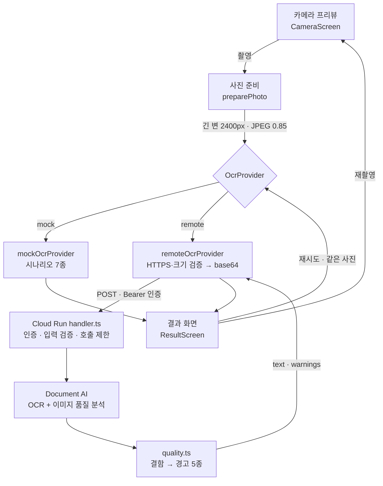
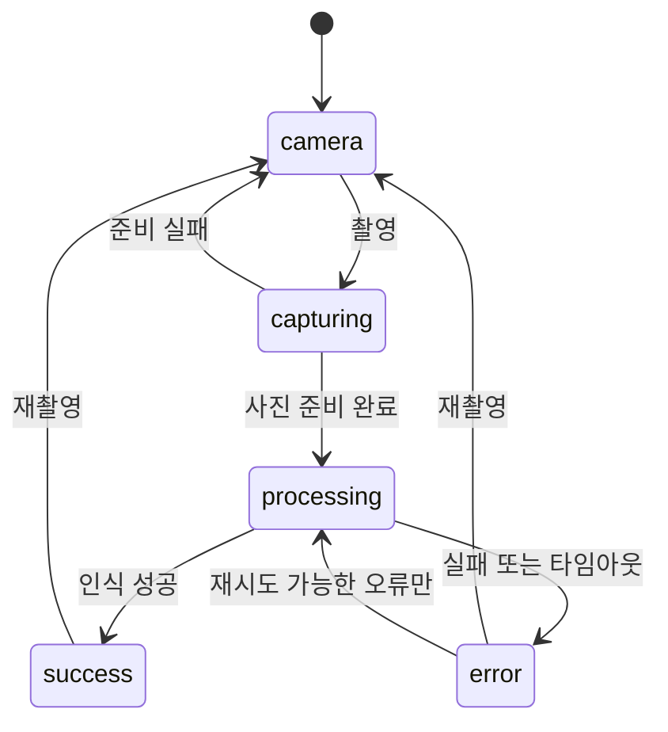

# ARTINUS OCR

2026-09 ARTINUS Frontend Engineer 과제 제출물입니다. React Native로 카메라 프리뷰에서 사진을 찍고, 그 정지 이미지를 Google Document AI로 인식해 결과를 화면에서 확인하는 앱입니다.

앱은 촬영한 JPEG를 직접 만든 TypeScript Cloud Run 함수로 보냅니다. 함수가 Document AI에서 텍스트와 이미지 품질 정보를 함께 받아 앱에 돌려줍니다. 네트워크와 자격증명 없이 오류·취소 흐름만 확인할 수 있는 모의 OCR 모드도 있습니다.

문서는 아래 항목이 과제의 평가항목 순서를 따릅니다.

| 평가항목 | 이 문서의 위치 |
| --- | --- |
| 기능 완성도 | [1. 구현한 흐름](#1-구현한-흐름) |
| 예외 처리 및 설계 | [2. 예외 처리](#2-예외-처리) · [3. 기술 선택과 구조](#3-기술-선택과-구조) |
| 실기기 성능 | [4. 성능과 스레드](#4-성능과-스레드) |
| 테스트 전략 | [5. 테스트 전략과 검증 결과](#5-테스트-전략과-검증-결과) |
| AI 활용 능력 | [6. AI 활용 기록](#6-ai-활용-기록) |

---

## 실행 방법

실행 방법은 두 가지입니다.

| 방법 | 필요한 것 | 걸리는 시간 | 한계 |
| --- | --- | --- | --- |
| **A. Expo Go** (권장) | 스마트폰, Node.js | 5분 | `app.json`의 네이티브 설정 미적용 |
| **B. 직접 빌드** | Xcode 또는 Android SDK | 첫 빌드 10~20분 | 없음 |

**A를 권장합니다.** 실기기 카메라 촬영과 실제 Google OCR 응답까지 5분 안에 확인할 수 있습니다.

### 공통 — Node.js

```sh
node -v     # v22 이상
```

---

## A. Expo Go로 실행 (빌드 불필요)

이 앱이 사용하는 Expo 모듈은 모두 Expo Go에 포함되어 있어 별도 빌드 없이 실행됩니다.

**1) Expo Go 설치** — App Store 또는 Play Store에서 설치합니다. 기기와 개발 머신이 같은 Wi-Fi 네트워크에 있어야 합니다.

**2) 개발 서버 실행**

```sh
git clone https://github.com/blissful-y0/artinus-ocr.git
cd artinus-ocr/apps/mobile
npm ci
npx expo start --go
```

**3) 기기에서 접속**

- **iOS**: 기본 카메라 앱으로 터미널의 QR 코드를 인식하면 Expo Go가 실행됩니다. QR 인식이 되지 않으면 Safari 주소창에 터미널에 출력된 `exp://192.168.x.x:8081`을 직접 입력합니다.
- **Android**: Expo Go를 실행하고 `Scan QR code`로 인식합니다.

**4) 접근 코드 입력** — 앱 첫 화면에 제출 메일의 평가용 접근 코드를 입력합니다.

Expo Go는 `app.json`의 네이티브 설정(카메라 권한 안내 문구, `blockedPermissions`)을 적용하지 않습니다. 따라서 권한 요청 문구는 Expo Go의 기본값이 표시됩니다. 이 설정까지 확인하려면 B 방법으로 빌드합니다.

---

## B. 직접 빌드해서 실행

Expo development build를 사용합니다. `android/`와 `ios/` 디렉터리는 저장소에 포함하지 않으며, `npm run ios` 또는 `npm run android` 실행 시 Expo가 생성합니다. 별도 준비는 필요 없고 **첫 실행에 10~20분이 소요됩니다.**

### B-1. iOS (macOS 필요)

다음 세 가지가 필요합니다.

```sh
# 1) Xcode — App Store에서 설치 후 한 번 실행해 약관 동의
xcode-select --install

# 2) CocoaPods
sudo gem install cocoapods
#    또는 brew install cocoapods

# 3) iOS 시뮬레이터 — Xcode > Settings > Components 에서 하나 받기
```

실행:

```sh
git clone <이 저장소 주소>
cd artinus-ocr/apps/mobile
npm ci
npm run ios
```

시뮬레이터가 실행되고 앱이 설치됩니다. 실기기에 설치하려면 `npx expo run:ios --device`를 사용합니다. 이때 **Xcode가 기기의 iOS 버전을 지원해야 합니다.** 기기 iOS가 Xcode보다 최신이면 설치할 수 없습니다.

### B-2. Android (macOS·Windows·Linux)

다음이 필요합니다.

```sh
# 1) JDK 17
brew install openjdk@17          # macOS
export JAVA_HOME=/opt/homebrew/opt/openjdk@17

# 2) Android SDK — Android Studio를 설치하면 같이 깔립니다.
#    Android Studio 없이 하려면:
brew install --cask android-commandlinetools
export ANDROID_HOME=/opt/homebrew/share/android-commandlinetools

# 3) SDK 구성요소 — NDK가 빠지면 빌드가 cmake 오류로 실패합니다
sdkmanager --install "platform-tools" "emulator" \
  "platforms;android-36" "ndk;27.1.12297006" \
  "system-images;android-36;google_apis;arm64-v8a"

# 4) 에뮬레이터 만들고 켜기 (카메라 흐름까지 보려면 -camera-back 옵션을 주세요)
avdmanager create avd -n artinus -k "system-images;android-36;google_apis;arm64-v8a" -d pixel_7
$ANDROID_HOME/emulator/emulator -avd artinus -camera-back virtualscene
```

실행:

```sh
cd artinus-ocr/apps/mobile
npm ci
npm run android
```

## 실제 OCR 사용 — 접근 코드 입력

저장소의 `apps/mobile/.env`에 배포된 서버 주소가 들어 있습니다. 복사하거나 수정할 필요가 없습니다. 앱을 실행하면 첫 화면에서 접근 코드를 요구합니다. **제출 메일에 함께 보낸 평가용 접근 코드**를 입력하면 실제 Google OCR로 동작합니다.

접근 코드는 앱 실행 중 메모리에만 유지되며 파일이나 저장소에 기록하지 않습니다.

서버는 최대 인스턴스 3, 인스턴스당 동시 2건, 60초당 10건으로 제한합니다. 인스턴스는 요청이 있을 때만 기동하므로 유휴 비용이 발생하지 않습니다. 한도를 초과하면 429를 반환하며, 잠시 후 재시도하면 됩니다.

## 접근 코드 없이 화면 흐름만 확인

`apps/mobile/.env`에서 다음 값을 바꾸고 Metro를 재시작합니다.

```sh
EXPO_PUBLIC_OCR_MODE=mock
```

네트워크 연결과 접근 코드 없이 성공, 텍스트 없음, 품질 경고, 실패 후 재시도, 느린 응답, 타임아웃, 취소 후 늦은 응답 시나리오를 선택할 수 있습니다. 표시되는 텍스트와 경고는 고정값이며, 화면에 "실제 인식 결과가 아닙니다"를 항상 표시합니다.

시뮬레이터에는 카메라가 없습니다. `EXPO_PUBLIC_ENABLE_FIXTURE=true`로 설정하면 샘플 이미지로 촬영을 대체하는 버튼이 나타납니다. 이 버튼은 개발 빌드에서만 표시되며, remote 모드에서는 샘플 이미지도 실제 서버로 전송합니다.

## 테스트 실행

```sh
cd apps/mobile  && npm run typecheck && npm test   # 타입 검사 + 단위 테스트 20건
cd apps/ocr-api && npm ci && npm test              # 서버 테스트 8건
```

## 문제 해결

| 증상 | 원인과 해결 |
| --- | --- |
| 첫 빌드가 끝나지 않음 | 정상 동작입니다. 네이티브 프로젝트 생성과 컴파일에 10~20분이 소요됩니다 |
| Android 빌드가 cmake에서 실패 | NDK가 없습니다. `sdkmanager --install "ndk;27.1.12297006"` |
| 실기기에 설치되지 않음 (iOS) | Xcode가 기기의 iOS 버전을 지원하지 않습니다. Xcode를 업데이트하거나 A 방법(Expo Go)을 사용합니다 |
| 401이 반복됨 | 접근 코드가 일치하지 않습니다. 화면 상단 "코드 변경"으로 다시 입력합니다 |
| 촬영 버튼이 반응하지 않음 | 카메라 준비 중입니다. 프리뷰가 표시되면 활성화됩니다 |

`EXPO_PUBLIC_*` 값은 앱 번들에 그대로 포함됩니다. API 키, 서비스 계정 키, 접근 코드는 이 파일에 넣지 않습니다.

---

## 1. 구현한 흐름



상태는 다섯 가지 중 하나이고, 각 상태가 어떤 값을 갖는지 타입으로 정해져 있습니다. 그래서 사진 없는 결과 화면 같은 조합은 아예 만들 수 없습니다.



| 화면 | 하는 일 |
| --- | --- |
| 접근 코드 | remote 모드 첫 화면. 코드를 메모리에만 보관. 인증 실패 시 코드 변경 경로 제공 |
| 카메라 | 프리뷰, 촬영, 조명(토치), 권한 거부·카메라 열기 실패 복구 |
| 결과 | 촬영 사진, 처리 중·성공·실패 상태, 인식 텍스트, 품질 경고, 사진 확대(1~3배), 재시도·재촬영 |


**범위 밖**: 텍스트 수정·복사(과제에서 불필요로 명시), 실시간 프레임 OCR, 촬영 기록 저장, 자동 이미지 보정.

### 서버 API 규격

앱과 Cloud Run 함수가 주고받는 형식입니다. 자세한 내용은 [서버 README](apps/ocr-api/README.md)에 있습니다.

```http
POST /ocr
Authorization: Bearer <평가용 접근 코드>
Content-Type: application/json

{ "requestId": "...", "imageBase64": "...", "mimeType": "image/jpeg" }
```

```json
200 { "requestId": "...", "text": "...", "warnings": ["LOW_LIGHT"], "source": "remote" }
4xx { "error": { "code": "UNAUTHORIZED", "message": "...", "retryable": false } }
```

| 상태 | 뜻 |
| --- | --- |
| 401 | 접근 코드 불일치 |
| 413 · 415 · 400 | 크기 초과, JPEG 아님, 형식 오류 |
| 429 | 호출 제한 초과 |
| 504 | Document AI 제한 시간 초과 |
| 502 · 500 | 업스트림 실패, 서버 설정 문제 |

앱은 응답을 그대로 믿지 않습니다. 요청 ID 일치, 경고 코드 유효성, `source` 값을 검증하고, 서버가 `retryable: true`라고 답해도 `UNAUTHORIZED`·`INVALID_IMAGE`·`CONFIGURATION`은 재시도 불가로 덮어씁니다.

### 코드 구조

```
apps/mobile/
  App.tsx                         모드 판단, 화면 전환, 앱 상태 구독
  src/features/scan/
    types.ts                      상태 머신·OcrProvider·오류 코드 정의
    useScan.ts                    촬영·인식·취소·재시도 상태 관리
    constants.ts                  2400px, 0.85, 5MiB, 제한 시간 (근거 주석 포함)
    messages.ts                   사용자에게 보이는 오류 문구
  src/services/
    photoFiles.ts                 네이티브 리사이즈·JPEG 변환·임시 파일 수명
    mockOcrProvider.ts            시나리오 7종, 네트워크 없음
    remoteOcrProvider.ts          HTTPS 검증 → base64 → fetch → 응답 형식 검증
  src/screens/                    AccessCode · Camera · Result · PhotoViewer

apps/ocr-api/src/
  handler.ts                      인증 → 입력 검증 → 호출 제한 → Document AI
  quality.ts                      결함 → 경고 5종 변환 (confidence ≥ 0.5)
  config.ts                       환경변수 읽기와 형식 검사
```

읽는 순서를 추천하면 `types.ts` → `useScan.ts` → `handler.ts`입니다. 이 셋이 설계의 대부분입니다. 화면·상태·서버 흐름을 한눈에 보려면 [구조도](docs/architecture.html)를 브라우저에서 여세요.

---

## 2. 예외 처리

### 카메라 권한

| 상황 | 앱 동작 |
| --- | --- |
| 아직 안 물어봄 | "카메라 권한 허용" 버튼으로 시스템 권한 요청 |
| 거부했고 다시 물어볼 수 있음 | 같은 버튼으로 재요청 |
| 거부했고 다시 못 물어봄 | "설정 열기" 버튼으로 시스템 설정 이동 |
| 설정에서 허용하고 돌아옴 | 앱 활성화 시 권한을 다시 읽어 프리뷰 자동 복구 |
| 카메라 열기 실패 | "카메라 다시 열기" 버튼으로 프리뷰 재마운트 |

권한이 없으면 촬영·조명 버튼이 비활성화됩니다. 카메라가 준비되기 전(`onCameraReady` 이전)에도 촬영을 받지 않습니다.

### OCR 실패

오류를 8종으로 나누고, 각각 **같은 사진으로 재시도해서 될 일인지**를 따로 판정합니다.

| 코드 | 재시도 | 사용자에게 안내하는 것 |
| --- | --- | --- |
| `NETWORK` / `SERVER` / `TIMEOUT` / `RATE_LIMITED` | 가능 | 같은 사진으로 다시 시도 |
| `INVALID_IMAGE` | 불가 | 다시 촬영 |
| `UNAUTHORIZED` | 불가 | 접근 코드 재입력 |
| `CONFIGURATION` | 불가 | 서버 설정 확인 |
| `CANCELLED` | 해당 없음 | 사용자가 취소한 것이므로 화면에 반영하지 않음 |

서버가 `retryable: true`라고 답해도 `UNAUTHORIZED`·`INVALID_IMAGE`·`CONFIGURATION`은 앱에서 재시도 불가로 덮어씁니다. 잘못된 코드로 무한 재시도하는 일을 막습니다.

### 나쁜 입력

Document AI의 품질 결함 정보를 confidence 0.5 이상일 때 경고로 바꿔 결과와 **함께** 보여줍니다. 경고가 있어도 인식 결과는 그대로 표시합니다. 품질 점수는 인식 정확도가 아니라 결함 추정치라서, 읽히는 사진을 막을 위험이 더 크다고 봤습니다.

| 경고 | 대응 안내 |
| --- | --- |
| 어두운 사진 | 밝은 곳에서 촬영 (앱에 조명 버튼 제공) |
| 흐림 가능성 | 카메라 고정 후 초점 맞추고 촬영 (`autofocus="on"`) |
| 빛 반사 가능성 | 촬영 각도 변경 |
| 작은 글자 | 가까이 촬영 |
| 잘린 내용 가능성 | 필요한 글자가 다 들어오도록 촬영 |

기울어진 텍스트는 별도 감지·보정을 넣지 않았습니다. 회전은 Document AI가 자체 보정합니다. Document AI의 결함 목록에 기울기 항목이 없어 경고로 만들 수단도 없습니다. iPhone 17 Pro 실기기에서 30~45도 기울여 찍은 글자가 정상 인식되는 것을 확인했습니다. 그래도 안 읽히면 원본 사진을 확대해 비교하고 다시 찍는 경로를 둡니다.

### 요청이 중복되거나, 실패한 경우

- 처리 중 재촬영하면 이전 요청을 무효화합니다. 요청 순번와 `AbortController`를 같이 씁니다.
- 프로바이더가 취소를 무시하고 늦게 응답해도 화면에 반영하지 않습니다.
- 임시 사진 파일은 프로바이더가 읽는 중이면 삭제를 미룹니다.
- 앱이 백그라운드로 가면 카메라를 해제하고 진행 중 촬영을 무효화합니다. 이미 시작한 OCR 결과는 유지합니다.

---

## 3. 기술 선택과 구조

| 선택 | 이유 |
| --- | --- |
| **React Native + TypeScript** | 플러터를 고르지 않은 이유는 아래 후술합니다 |
| **Expo development build + Expo Camera** | 필요한 카메라 기능을 확보하면서 관리할 설정을 최소한으로 줄이기 위해 채택했습니다, OCR이 가장 큰 목적이라고 판단했습니다 |
| **Expo Image Manipulator / FileSystem** | 화면 제어와 이미지 쪽 연산을 분리하기 위해 채택했습니다 |
| **클라우드 OCR (Google Document AI)** | 온디바이스 모델 통합·번들 크기 부담 없이, OCR과 이미지 품질 분석을 동시에 진행 가능합니다 |

### 왜 Flutter가 아니라 Expo인가

렌더링과 스레딩은 측면에서는 Flutter가 낫지만, Expo를 고른 이유는 접근성입니다.

- Expo Go를 쓰면 평가자가 Xcode나 Android SDK 없이 실기기에서 바로 확인할 수 있습니다. 앱 환경에서 개발하면서 가장 불편했던 점이 바로 환경 설정이라, 검증 용이성을 위해 Expo가 있는 React Native를 택했습니다.
- 앱과 Cloud Run 함수가 모두 TypeScript라 `OcrResult`·`OcrError`·경고 코드 정의를 같이 쓸 수 있습니다. Flutter였다면 Dart와 TypeScript로 같은 정의를 두 번 쓰고, 컴파일러가 잡지 못합니다.
- `app.json`만 고치면 권한 문구와 `blockedPermissions`가 양쪽 네이티브 프로젝트에 반영됩니다. Xcode 프로젝트를 직접 건드릴 일이 없어 `ios/`·`android/`를 저장소에서 빼도 평가자가 같은 결과로 빌드합니다.

이 앱은 카메라 프리뷰 하나와 텍스트 화면 하나입니다. Flutter의 강점이 발휘될 렌더링 부하가 없고, Expo의 강점은 바로 값어치가 났습니다. 다만 요구 사항이 많고 렌더링이 무거운 앱이었다면 플러터를 선택했을 것 같습니다.

### 왜 Cloud Vision API가 아니라 Document AI인가

먼저, 단순 OCR 용도에는 Vision API가 더 싸고 단순합니다. 그런데 **"저조도·블러 대응" 요구를 충족할 수단이 없습니다.**

Vision API에도 `blurredLikelihood`, `underExposedLikelihood` 필드가 있지만 이것은 **얼굴 검출 결과**입니다. 문서 사진의 흐림이나 노출을 알려주지 않습니다. 이름만 보고 쓰면 항상 비어 있는 값을 읽게 됩니다. 과제는 텍스트를 읽는 OCR이 목적이기 때문에 Document API를 사용해야 한다고 봤습니다.

Document AI Enterprise Document OCR은 `enableImageQualityScores` 옵션으로 dark, blurry, glare, text_too_small, cutoff 같은 결함을 confidence와 함께 돌려줍니다. 앱의 품질 경고는 위의 API 응답값을 기반으로 합니다. OCR과 품질 분석을 **한 번에** 받을 수 있다는 점도 매력적이었습니다.

### 주요 수치

| 값 | 설정 | 근거 |
| --- | --- | --- |
| 사진 긴 변 | 2400px | 작은 글자를 남기면서 5MiB 전송 한도에 여유 |
| 업로드 JPEG 품질 | 0.85 | 더 낮추면 얇은 획이 뭉개짐 |
| 전송 상한 | 5MiB | 서버가 같은 값으로 거절하므로 앱에서 먼저 차단 |
| 앱 제한 시간 | mock 10초 / remote 40초 | 서버 HTTP 35초·SDK 25초보다 길게 둬서 서버 오류가 먼저 도달 |
| 품질 경고 기준 | confidence ≥ 0.5 | 포함 기준. 값은 정확도가 아님 |

전부 `src/features/scan/constants.ts` 한 곳에 근거 주석과 함께 있습니다. 사용자에게 보이는 오류 문구는 `src/features/scan/messages.ts`에 모았습니다.

### Trade-off와 알려진 한계

- **클라우드 OCR**: 네트워크 지연·실패·비용이 있고 사진이 Google Cloud로 전송됩니다. 온디바이스였다면 오프라인 동작이 가능하지만, 클라우드는 불가능합니다.
- **사진·텍스트 저장 안 함**: 앱과 함수 모두 별도 저장소에 남기지 않고 로그에도 찍지 않습니다. 이전 결과를 별도로 저장해 주지 않는 이상 휘발성입니다.
- **카메라 제어의 한계**: `expo-camera`는 AVFoundation·CameraX가 여는 기능의 일부만 제공합니다. 수동 노출·ISO·초점 거리 조절, RAW 촬영, 저조도에서 여러 프레임을 합쳐 노이즈를 줄이는 처리를 쓸 수 없습니다. 네이티브 앱이었다면 저조도 요구 같은 미세한 부분을 다룰 수 있었겠지만, API 응답값에 따른 품질 경고 안내로 대응하는 것으로 결정했습니다.

---

## 4. 성능과 스레드

무거운 작업을 전부 네이티브로 넘겨 UI 스레드를 막지 않는 것을 최우선으로 합니다.

| 작업 | 실행 위치 | JS 스레드 차단 | UI 스레드 차단 |
| --- | --- | --- | --- |
| 촬영 (`takePictureAsync`) | 네이티브 | 없음 | 없음 |
| 리사이즈 + JPEG 인코딩 | 네이티브 | 없음 | 없음 |
| 파일 읽기 + base64 | 네이티브 (`file.base64()`) | 없음 | 없음 |
| 요청 본문 `JSON.stringify` | JS (Hermes) | **있음** | 없음 |
| HTTP 전송 | 네이티브 | 없음 | 없음 |

`base64Sync` 동기 API는 의도적으로 쓰지 않았습니다. 그것을 썼다면 파일 읽기 전체가 JS 스레드를 멈춥니다.

**남은 한계**: 전송 직전 base64 문자열(최대 약 6.7MB)을 JSON으로 만드는 구간만 JS 스레드에서 동기로 돕니다. 이 순간 순간적으로 10MB대 문자열이 JS 힙에 올라옵니다. UI 스레드는 막히지 않아 프리뷰·스크롤은 계속 부드럽고, 화면도 이미 "텍스트를 읽고 있어요" 상태라 영향은 작습니다. 멀티파트 업로드로 바꾸면 이 구간과 힙 사용이 함께 사라집니다. 검증된 전송 경로를 제출 직전에 바꾸지 않기로 하고 한계로 남겼습니다.

**검증한 기기**: iPhone 17 Pro 실기기(iOS 27.2, Expo Go), iPhone 17 Pro / iOS 26.2 시뮬레이터, Android API 36 에뮬레이터(Pixel 7, arm64). 실제 검증이 가능한 안드로이드 기기가 없어서 안드로이드 실제 기기 검증은 진행하지 못했습니다.

실기기에서 확인한 것은 프리뷰가 끊기지 않는 것, 촬영에서 실제 Google OCR 응답까지 오는 것, 기울여 찍은 글자도 읽히는 것, 일부러 어둡게·흔들어 찍었을 때 해당 경고가 뜨는 것, 비행기 모드에서 오류 화면과 다시 시도 버튼이 나오는 것, 처리 중 재촬영해도 이전 결과가 섞이지 않는 것입니다. 연속 촬영에서 버벅임이나 두드러진 발열도 없었습니다.

지연 시간·메모리·발열은 직접 써 보며 확인한 것이지 계측하지 않았습니다. 품질 경고도 뜨는 것만 봤고 어느 밝기부터 뜨는지, 오탐이 얼마나 되는지는 재지 않았습니다. Expo Go로 띄웠으므로 `app.json`의 네이티브 설정과 릴리스 번들 성능은 이 검증에 포함되지 않습니다.

---

## 5. 테스트 전략과 검증 결과

단위 테스트는 **E2E로 확인하기 비싸거나 불안정한 곳**에만 뒀습니다. 취소, 타임아웃, 재시도처럼 타이밍이 얽힌 부분입니다. 화면 흐름은 Maestro E2E가 맡습니다. 커버리지 숫자를 채우는 대신, 깨져도 티가 안 나고 조용히 틀린 결과를 보여줄 곳을 골랐습니다.

| 층 | 대상 | 개수 |
| --- | --- | --- |
| 단위 (`useScan`) | 취소한 요청의 늦은 응답 무시, 파일 삭제 지연, 같은 사진 재시도, 재시도 불가 오류, 타임아웃과 abort, 사진 준비 실패, 처리 중 재촬영 | 8 |
| 단위 (`remoteOcrProvider`) | 요청 ID 불일치·알 수 없는 경고 코드 거부, 401 비재시도, 서버 응답보다 앱 판정 우선, https 아닌 주소·잘못된 코드·5MB 초과를 전송 전 차단 | 12 |
| 단위 (서버) | 인증 실패 시 닫힘, 입력 크기·형식 경계, 동시 실행·호출 제한, 실제 `google-gax` 옵션 병합, 업스트림 오류 매핑 | 8 |
| E2E | `core` / `recovery` / `stale-response` / `android-camera` / `remote` | 5 흐름 |

실행 방법과 각 흐름의 내용은 [검증 기록](docs/VALIDATION.md)에 있습니다.

### 검증 결과

| 구분 | 상태 |
| --- | --- |
| TypeScript·포맷·Expo 의존성 검사 | 통과 |
| 모바일 단위 테스트 20건 | 통과 |
| 서버 단위 테스트 8건 | 통과 |
| iOS·Android JS/Hermes 번들 생성 | 통과 |
| iOS 시뮬레이터 Debug 빌드 | 성공 |
| iOS 시뮬레이터 E2E | mock 3흐름 + 실제 서버 remote 흐름 통과 |
| Android Debug 빌드 | 성공 |
| Android 에뮬레이터 E2E | mock 3흐름 + 실제 카메라 촬영 + 실제 서버 remote 흐름 통과 |
| 실제 Google OCR 호출 | 텍스트 인식 성공, 1회 측정 1,804ms, 품질 경고 전달 확인 |
| iPhone 17 Pro 실기기 (Expo Go) | 프리뷰·촬영·실제 OCR, 기울어진 글자, 저조도·흐림 경고, 비행기 모드 오류, 처리 중 재촬영 확인 |
| Android 실기기 프리뷰·메모리·발열 | 미검증. 검증 가능한 기기 없음 |

### 검증하지 못한 것

- **실기기 성능의 수치.** iPhone 17 Pro에서 프리뷰와 촬영이 문제없이 도는 것은 확인했지만, 지연 시간·메모리·발열을 숫자가 있는 수치로 재지는 않았습니다. Android는 실기기가 없어 에뮬레이터로만 봤고, 이것이 실기기 성능을 대신하지 못합니다.
- **네이티브 빌드의 실기기 설치.** 실기기 검증은 Expo Go로 했습니다. 이 맥의 Xcode가 기기 iOS 버전보다 낮아 네이티브 빌드를 기기에 설치하지 못했습니다. `app.json`의 권한 문구와 차단 권한 목록은 시뮬레이터·에뮬레이터에서만 확인했습니다.
- **품질 경고의 실제 정확도.** 합성 샘플에서도 경고가 나왔으므로, 이를 결함 검출 정확도의 증거로 보지 않습니다.
- **지연 시간 분포.** 실제 OCR 측정은 1회뿐입니다. 콜드 스타트와 일반 지연을 대표하지 않습니다.

---

## 6. AI 활용 기록

Claude Code Fable 5.1 / Opus 5.5를 오케스트레이터로 두고 작업을 진행했습니다. Codex의 Astra는 코드 리뷰와 검증에 사용했고, 서브 에이전트는 GPT-6 Luna max effort를 활용했습니다. 기반·카메라, 결과 화면, 모의 OCR은 파일 단위로 쪼개 서브 에이전트가 동시에 만들고 메인 에이전트가 합쳐서 검사했습니다.

| 모델 | 맡긴 일 |
| --- | --- |
| Claude Code Fable 5.1 / Opus 5.5 (오케스트레이터) | 태스크 할당, 문서 윤문 |
| Codex 6 Astra (리뷰·검증) | 구현 결과 교차 검토, 코드 리뷰 |
| GPT-6 Luna max effort | 실제 구현 |

### AI가 생성한 것을 그대로 쓴 부분

초기 앱 기반, 화면 구성, 상태 전환 코드, 모의·원격 OCR 프로바이더, TypeScript 서버, 배포 스크립트, 문서 초안. 타입·포맷·테스트·E2E.

### 검증해서 고친 부분

- **실제 호출에서만 드러난 SDK 버그.** 코드 리뷰와 타입 검사를 통과한 `{ timeout, retry: null, maxRetries: 0 }` 옵션이 배포 후 첫 실호출에서 `google-gax`라는 내부 TypeError를 냈습니다. 두 옵션은 함께 사용해서는 안 되었기 때문에 직접 `maxRetries`를 제거했습니다. 실제로 테스트를 진행하고 콘솔에 값을 찍기 전까지는 알 수 없는 값이었습니다.
- **화면 결함.** 확대 이미지 치수, 모달 안전 영역, 개발 버튼과 닫기 버튼 겹침 같은 기본적인 UI/UX 문제가 있어 실제 화면을 보고 UI를 변경했습니다.

### AI 제안을 기각하거나 직접 판단한 것

- **자체 품질 분석** Python·OpenCV로 저조도·블러를 직접 판별하자는 제안을 받았지만, Document AI가 같은 결함 정보를 서버 왕복 한 번에 함께 주므로 채택하지 않았습니다. 별도의 파이썬 스크립트 등을 사용해서 사진의 품질을 검증하는 절차가 있었어야 했습니다. AI는 직접 스크립트를 짤 것을 제안했으나 이미 있는 바퀴를 재발명할 필요가 없다고 판단해서 Document AI 사용을 최종 채택했습니다.
- **Flutter 사용** 렌더링과 스레딩은 Flutter가 낫다고 판단했으나, 실 기기 검증의 용이성 및 플러터 사용을 고려할 수준의 무거운 앱이 아니라고 판단해서 React Native + Expo 조합을 골랐습니다.
- **품질 경고가 있으면 OCR 결과를 아예 띄워주지 않기** 경고가 뜨면 인식을 막고 재촬영을 강제하자는 안을 버렸습니다. 품질 점수는 정확도보다는 단순히 결함에 대한 추정치라고 생각해서, OCR 결과를 보여주고 경고를 같이 보여주는 것으로 변경했습니다.

---

## 문서

- [상세 구조도](docs/architecture.html) 
- [구현 스펙](docs/SPEC.md) — 확정한 결정과 API 규격
- [기술 조사](docs/RESEARCH.md) — 라이브러리·서비스 비교
- [검증 기록](docs/VALIDATION.md) — 실행 방법, 날짜별 검증 결과와 한계
- [GCP 연결 상태](docs/GCP_SETUP.md) — 프로세서·서비스 계정·배포 설정
- [서버 README](apps/ocr-api/README.md) — 프록시 API 규격과 재현 방법
- [구현 계획](docs/IMPLEMENTATION_PLAN.md) — 에이전트 분담
